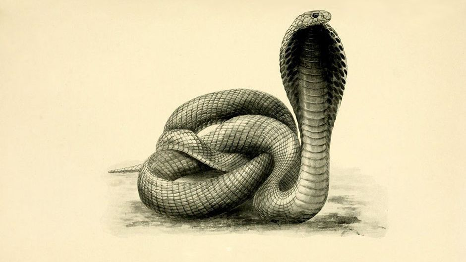

## Dolphins, systems and key performance indicators

### *Joe Wright*
#### __@joe_jag__
---

---

> Perverse incentives are incentives that result in unintended negative consequences due to actions people take to receive the incentive
-- Susan Fenner

---

Purpose

:arrow_down:

Measure

:arrow_down:

Method

---

~~Purpose~~

:arrow_down:

Target

:arrow_down:

Method

---

> People with targets and jobs dependent upon meeting them will probably meet the targets - even if they have to destroy the enterprise to do it. 
-- W. Edwards Deming

---

## Some fun targets from real organisations

---

# 100% Test Coverage

---

# *Lines of Code*

---

## How do you measure Scrum Masters  and Project Managers?

---

# Activity Targets

---

# Cycle Time and Story Count

----

$$ 
\frac{Outcome}{Output}
$$

---

---

# What are your questions?

### __@joe_jag__ - *Joe Wright*